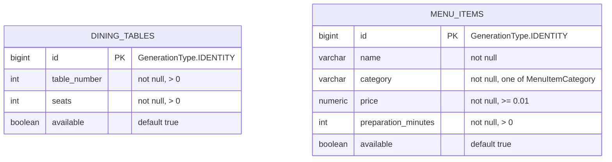

# Entity-relationship diagram

Two JPA entities exist today, and neither references the other — there is no
order, reservation, or booking entity yet tying a dining table to a menu item.

## Fields

### `dining_tables` (`DiningTable`)

| Column | Type | Constraint |
|---|---|---|
| `id` | `BIGINT` | primary key, identity |
| `table_number` | `INT` | `@Positive` |
| `seats` | `INT` | `@Positive` |
| `available` | `BOOLEAN` | defaults to `true` |

### `menu_items` (`MenuItem`)

| Column | Type | Constraint |
|---|---|---|
| `id` | `BIGINT` | primary key, identity |
| `name` | `VARCHAR` | `@NotBlank` |
| `category` | `VARCHAR(20)` | `@NotNull`, stored via `@Enumerated(EnumType.STRING)` |
| `price` | `NUMERIC` | `@NotNull`, `@DecimalMin("0.01")` |
| `preparation_minutes` | `INT` | `@Positive` |
| `available` | `BOOLEAN` | defaults to `true` |

`category` is not a foreign key. It's a plain string column that Bean
Validation and the `MenuItemCategory` enum keep constrained in application
code to one of: `STARTER`, `MAIN`, `DESSERT`, `DRINK`.

## Repositories

| Repository | Derived query |
|---|---|
| `DiningTableRepository` | `findBySeatsGreaterThanEqualAndAvailableTrue(int minSeats)` |
| `MenuItemRepository` | `findByCategoryAndAvailableTrue(MenuItemCategory category)` |

Both extend `JpaRepository<Entity, Long>`; Spring Data JPA generates the
implementation and derives each query from its method name.
